<div align="center">


<h1>Entra ID Maestro</h1>

<p><strong>The Global Standard for Industrialized Identity Orchestration and Zero Trust Operations</strong></p>

[]()
[]()
[]()
[]()

<br/>

> **"Industrializing identity management to orchestrate secure workforce and guest lifecycles at institutional scale."** 
> Entra ID Maestro (EI-M) is a flagship repository designed to enable global organizations to design, deploy, and govern Microsoft Entra ID environments through secure orchestration, automated lifecycles, and multi-tenant identity reference architectures.

</div>

---

## 🏛️ Executive Summary

**Entra ID Maestro (EI-M)** is a flagship repository designed for CIOs, CISOs, and Identity Leaders. As organizations embrace the "Identity is the New Perimeter" philosophy, the need for a unified, automated, and governed Identity and Access Management (IAM) platform becomes the critical foundation for security, productivity, and institutional compliance.

This platform provides an industrialized approach to **Identity Orchestration**, delivering production-ready **Lifecycle Automation**, **Conditional Access Governance**, **Privileged Access Management (PIM/PAM)**, and **Passwordless Transformation**. It supports **Microsoft Entra ID** at institutional scale, enabling organizations to transition from "Manual IAM" to "Industrialized Identity Operations."

---

## 💡 Why Identity Platforms Matter

A unified identity platform is the "central nervous system" of the modern enterprise:
- **Zero Trust Foundation**: Moving beyond network boundaries to protect users and data wherever they reside.
- **Automated Lifecycle**: Eliminating manual effort and "human-in-the-middle" risks for joiners, movers, and leavers.
- **Continuous Compliance**: Providing real-time visibility and automated remediation for identity security posture.
- **Institutional Guardrails**: Enforcing institutional security baselines across workforce, B2B guests, and application identities.

---

## 🚀 Business Outcomes

### 🎯 Strategic Identity Impact
- **Reduced Breach Risk**: Eliminating credential-based attacks through mandatory MFA, passwordless, and risk-based controls.
- **Increased Agility**: Accelerating M&A and partner onboarding through standardized multi-tenant orchestration.
- **Accelerated Compliance**: Providing automated evidence for ISO, SOC2, and HIPAA audits through standardized reporting.
- **Enhanced Developer Experience (DX)**: Providing self-service identity tools that allow engineers to focus on building rather than auth configuration.

---

## 🏗️ Technical Stack

| Layer | Technology | Rationale |
|---|---|---|
| **Identity Engine** | Python, PowerShell, Graph API | High-performance orchestration of institutional identity lifecycles and policies. |
| **Control Plane** | FastAPI | High-performance API for identity metadata, governance reviews, and platform health. |
| **Frontend** | React 18, Vite | Premium portal for executive dashboards, lifecycle boards, and identity scorecards. |
| **Automation** | Microsoft Graph SDK | Deep native integration with the Entra ID ecosystem for identity-as-code delivery. |
| **Database** | PostgreSQL | Centralized repository for identity inventory, audit history, and compliance evidence. |
| **Observability** | Prometheus / Grafana | Real-time monitoring of sync latency, MFA coverage, and identity risk spikes. |

---

## 📐 Architecture Storytelling: 90+ Diagrams

### 1. Executive High-Level Architecture
The holistic vision of the enterprise identity orchestration journey.

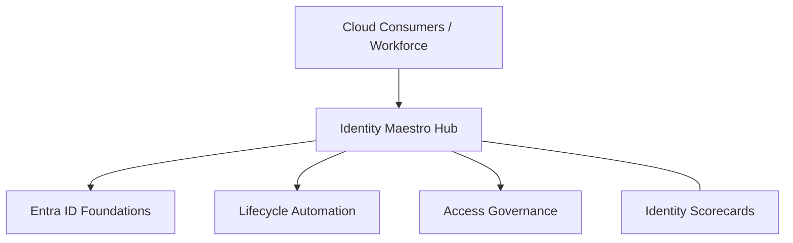

### 2. Detailed Platform Topology
The internal service boundaries and management layers of the industrialized maestro.

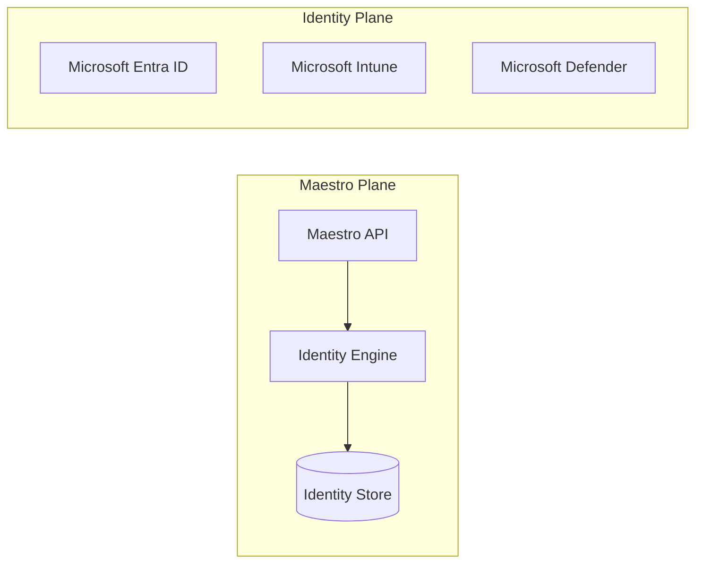

### 3. User Sign-In Request Path
Tracing the decision flow from a user sign-in to an access grant or block.

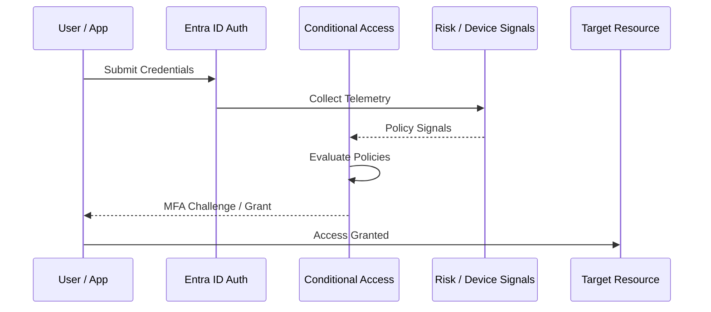

### 4. Identity Control Plane
The "Brain" of the framework managing global institutional standards and identity-as-code.

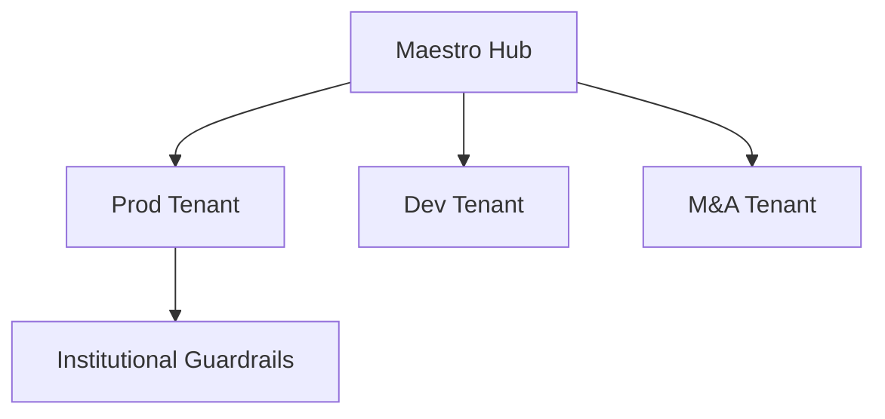

### 5. Multi-Tenant Topology
Synchronizing institutional identity standards across multiple Entra ID tenants.

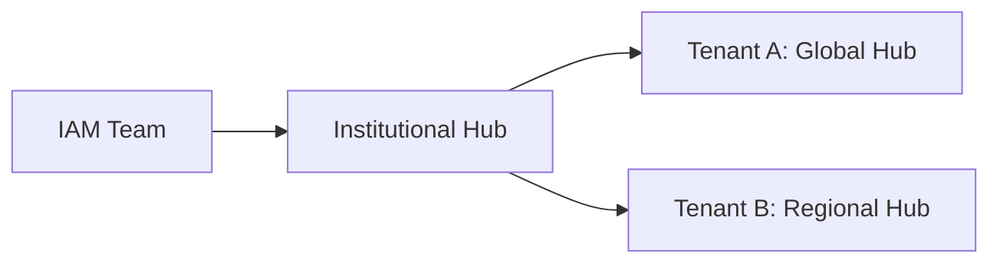

### 6. Regional Deployment Model
Hosting identity platform services close to the business users for low latency.

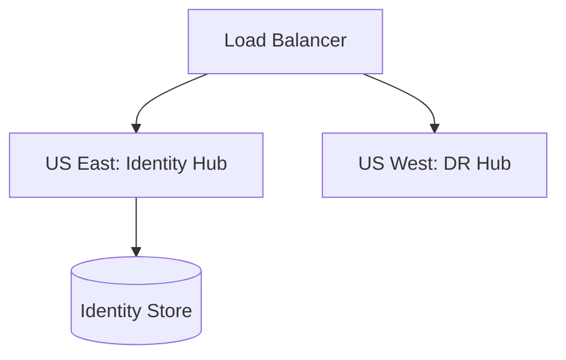

### 7. DR Failover Model
Ensuring platform continuity for critical identity services and shared infrastructure.

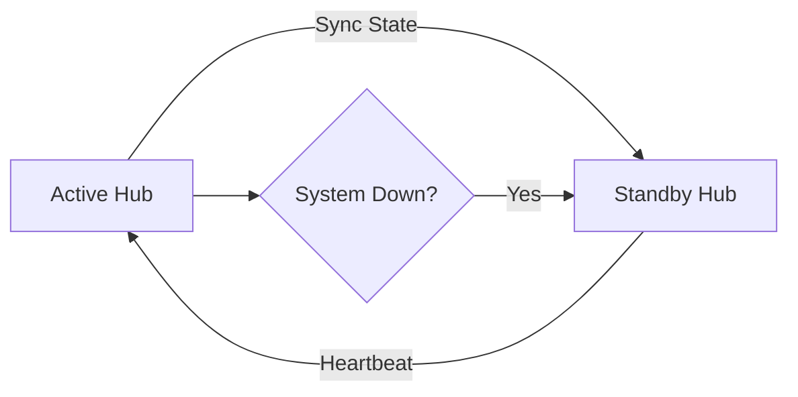

### 8. API Gateway Architecture
Securing and throttling the entry point for platform orchestration and metadata access.

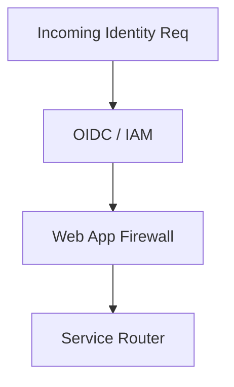

### 9. Queue Worker Architecture
Managing long-running provisioning, deprovisioning, and massive risk synchronization tasks.

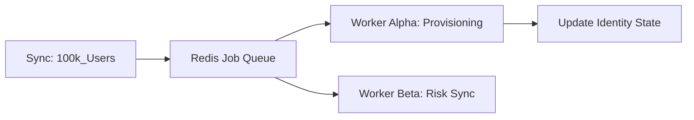

### 10. Dashboard Analytics Flow
How raw identity telemetry becomes executive institutional readiness scorecards.

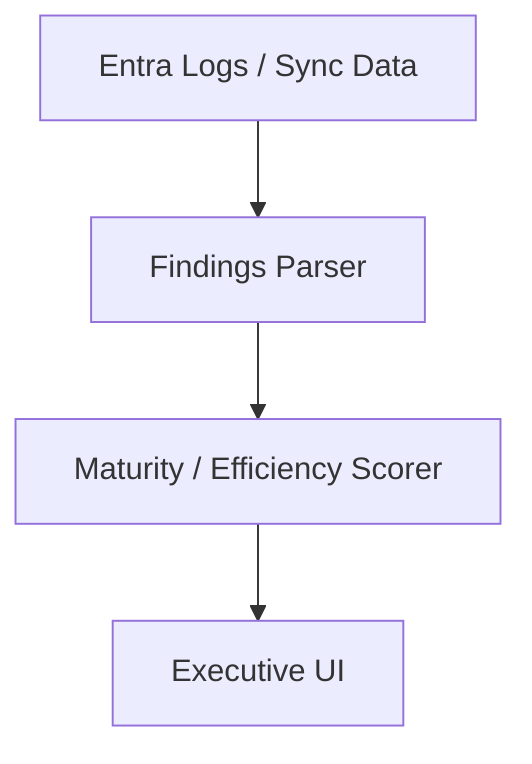

### 11. HR to Identity Provisioning Flow
The automated path for creating cloud identities from the HR system of record.

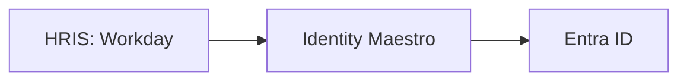

### 12. Joiner Lifecycle Model
Standardizing the Day-1 experience for every new institutional hire.

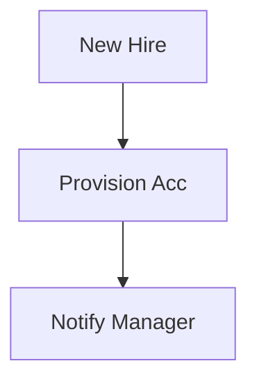

### 13. Mover Access Transition Flow
Automating the removal of old permissions and granting of new ones during team changes.

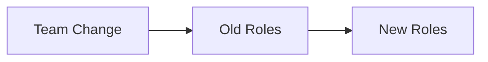

### 14. Leaver Deprovisioning Workflow
The critical security baseline for immediately revoking access upon departure.

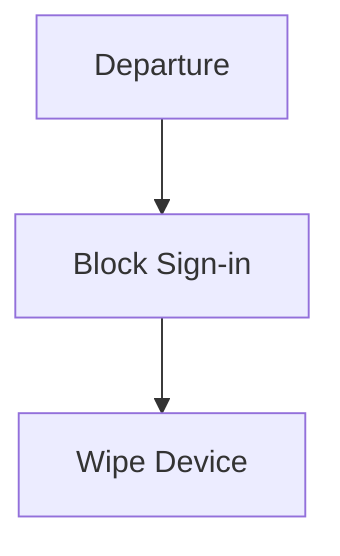

### 15. Birthright Access Model
Automatically granting core application access based on department and job code.

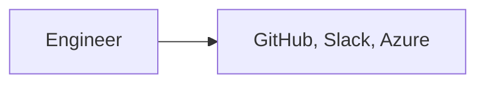

### 16. Role-Based Entitlement Flow
Governing complex access requirements through institutional role definitions.

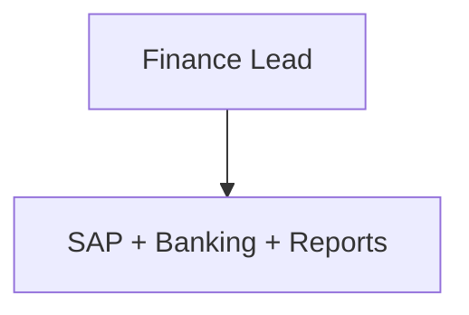

### 17. Access Package Lifecycle
Managing time-bound, self-service access requests through Entra entitlement management.

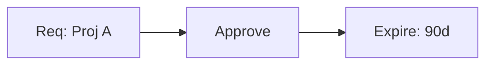

### 18. Manager Approval Workflow
The governance path for granting non-standard or sensitive application access.

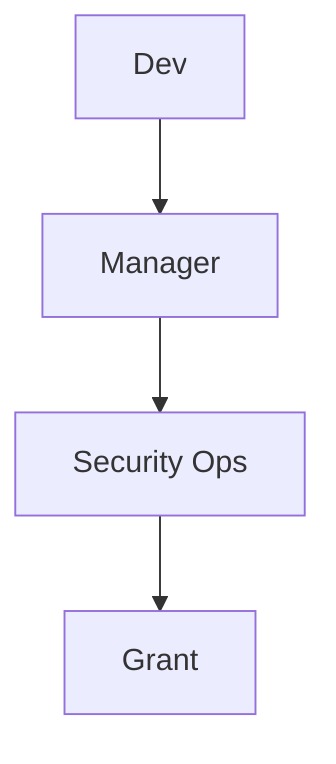

### 19. Group Automation Model
Eliminating manual group membership through attribute-based automation.

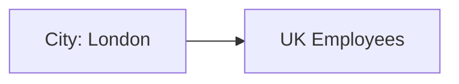

### 20. Dynamic Group Evaluation
How Entra ID continuously recalculates group memberships based on user changes.

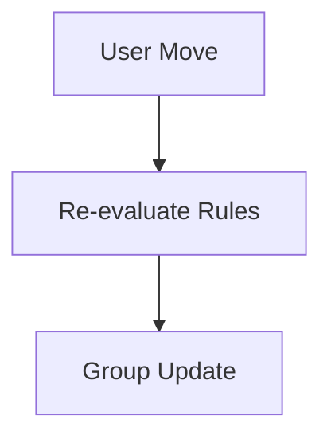

### 21. Conditional Access Evaluation Flow
The intelligent policy engine deciding access for every workforce request.

```mermaid
graph TD
    In[Req] --> CA[CA Policy] --> Result[MFA / Block]
```

### 22. MFA Challenge Workflow
The sequence of authentication prompts used to verify identity.

```mermaid
graph LR
    Sign[Sign-in] --> MFA{MFA Req?} --> Push[Phone Notification]
```

### 23. Passwordless Sign-in Model
Eliminating password risks through biometric and hardware-based authentication.

```mermaid
graph TD
    User[User] --> Face[FaceID] --> Cloud[Access]
```

### 24. FIDO2 Rollout Strategy
The phased journey for deploying hardware security keys to high-risk teams.

```mermaid
graph LR
    Pilot[Admin] --> Expand[Finance] --> Global[All]
```

### 25. Temporary Access Pass Model
Providing secure, short-lived access for method setup or account recovery.

```mermaid
graph TD
    Lost[Lost Method] --> TAP[Temp Pass: 1hr] --> Reg[New Method]
```

### 26. Risk-Based Authentication Flow
Automatically increasing security requirements when sign-in risk is detected.

```mermaid
graph LR
    Sign[Sign-in] --> Risk[Risk: High] --> Block[Block Access]
```

### 27. Session Governance Lifecycle
Monitoring and limiting session duration and activities in real-time.

```mermaid
graph TD
    Active[Active] --> Sess[Session Control] --> Logoff[Auto Logout]
```

### 28. Named Location Policy Model
Governing access based on corporate IP ranges and geographic boundaries.

```mermaid
graph LR
    IP[Home IP] --> Loc[Named Location] --> Allow[Grant]
```

### 29. Legacy Auth Block Pattern
The essential security baseline for removing legacy protocol vulnerabilities.

```mermaid
graph TD
    App[Legacy App] --> Block[CA Block]
```

### 30. Sign-in Anomaly Detection
Using machine learning to identify suspicious or "impossible" travel patterns.

```mermaid
graph LR
    NY[Sign-in: NY] --> LDN[Sign-in: London (10m later)] --> Alert[Anomaly]
```

### 31. PIM Activation Workflow
The "Just-in-Time" path for elevating to administrative roles.

```mermaid
graph TD
    Req[Elevate] --> Justify[Justify] --> Active[Active 4hr]
```

### 32. Just-in-time Admin Model
Reducing standing privilege through on-demand role assignment.

```mermaid
graph LR
    Standing[Zero Priv] --> JIT[Admin for Task] --> Return[Zero Priv]
```

### 33. Approval-based Elevation Flow
Requiring a second set of eyes for sensitive global admin activations.

```mermaid
graph TD
    Req[Req] --> Peer[Peer Review] --> Grant[Active]
```

### 34. Break-glass Emergency Model
The critical "Last Resort" access path for platform disaster recovery.

```mermaid
graph LR
    Lockout[Global Outage] --> Vault[Get Secret] --> BreakGlass[Login]
```

### 35. Admin Workstation Isolation
Enforcing that administrative tasks only occur on hardened, isolated devices.

```mermaid
graph TD
    Admin[Admin] --> SAW[Hardened PC] --> Portal[Cloud Portal]
```

### 36. Tiered Admin Model
Segmenting identity, application, and infrastructure administrators for blast radius control.

```mermaid
graph LR
    T0[Identity] --- T1[App] --- T2[Support]
```

### 37. High Privilege Review cycle
Continuously auditing who has the "Keys to the Kingdom."

```mermaid
graph TD
    Start[Review] --> Audit[Audit Roles] --> Clean[Revoke Unused]
```

### 38. Admin Audit Evidence Flow
Capturing every administrative action for regulatory and security auditing.

```mermaid
graph LR
    Act[Admin Action] --> Audit[Audit Log] --> Sentinel[SIEM]
```

### 39. Service Account Governance
Identifying and securing non-human identities used for automation.

```mermaid
graph TD
    SA[Service Acc] --> Policy[Fixed Location] --> Access[API]
```

### 40. Secret Rotation Lifecycle
Automating the update of app secrets and certificates.

```mermaid
graph LR
    Old[Secret v1] --> Rot[Rotate] --> New[Secret v2]
```

### 41. SaaS SSO Federation Flow
Unifying identity across Salesforce, Slack, AWS, and GCP.

```mermaid
graph LR
    App[SaaS] --> OIDC[Entra Auth] --> Access[Logged In]
```

### 42. App Registration Lifecycle
Standardizing how developers register and secure applications in Entra ID.

```mermaid
graph TD
    New[New App] --> Review[Security Scan] --> Live[Live]
```

### 43. OAuth Consent Governance
Preventing illicit data access by governing application permissions.

```mermaid
graph LR
    App[App] --> Req[Perm: Read Mail] --> Block[Admin Review Req]
```

### 44. B2B Collaboration Model
Governing how partners and guests access institutional resources.

```mermaid
graph TD
    Partner[External] --> B2B[B2B Policy] --> Teams[Teams/SP]
```

### 45. Cross-Tenant Access Settings
Configuring trust and inbound/outbound rules for external organizations.

```mermaid
graph LR
    OrgA[HQ] <-> Trust[Tenant Trust] <-> OrgB[Branch]
```

### 46. Contractor Access Lifecycle
Automating the time-bound access for external contingent workforce.

```mermaid
graph TD
    Start[Contract] --> Active[90 Days] --> End[Auto-Kill]
```

### 47. Customer Identity Extension
Integrating customer-facing applications with Entra External ID.

```mermaid
graph LR
    User[Customer] --> CIAM[Customer Portal] --> App[Storefront]
```

### 48. Merger Tenant Onboarding
Rapidly auditing and securing acquired Entra ID environments.

```mermaid
graph TD
    Acq[Acquisition] --> Scan[Risk Scan] --> Align[Policy Align]
```

### 49. API Workload Identity Flow
Securing machine-to-machine communication without credentials.

```mermaid
graph LR
    Pod[K8s Pod] --> Ident[Workload ID] --> Cloud[Access]
```

### 50. External Identities Roadmap
Strategic phases for migrating to a unified external collaboration model.

```mermaid
graph LR
    Ph1[Invites] --> Ph2[Self-Service] --> Ph3[Governance]
```

### 51. OIDC / SSO Auth Flow
The foundation of modern institutional single sign-on.

```mermaid
graph LR
    User[Dev] --> SSO[Entra Auth] --> Portal[App Hub]
```

### 52. RBAC Model
Defining granular roles for Maestro administrators and operators.

```mermaid
graph TD
    Role[Identity Admin] --> Perm[Manage Policies]
```

### 53. Audit Logging Architecture
The unified path for identity logs to the institutional data lake.

```mermaid
graph LR
    Sign[Logs] --> EventHub[Streaming] --> Sentinel[SIEM]
```

### 54. Metrics Pipeline
Transforming identity telemetry into real-time health and risk metrics.

```mermaid
graph TD
    App[Auth] --> Prom[Prometheus] --> Graf[Grafana]
```

### 55. Logging Architecture
The multi-layered approach to capturing identity and security events.

```mermaid
graph LR
    Log[Log] --> Forwarder[Fluent] --> Hub[Loki/Monitor]
```

### 56. Tracing Model
Observing identity authentication chains across hybrid and multi-cloud.

```mermaid
graph TD
    User[User] --> AD[Local AD] --> Entra[Cloud Auth]
```

### 57. Incident Response Workflow
The automated playbook for responding to identity-based threats.

```mermaid
graph TD
    Alarm[Alert] --> Playbook[Disable Acc] --> Invest[Investigate]
```

### 58. Insider Risk Correlation
Linking identity behavior with data access to detect malicious insiders.

```mermaid
graph LR
    Auth[Sign-in] <-> File[Large Download]
```

### 59. Identity Attack Disruption model
Where Maestro breaks the attacker's path to data exfiltration.

```mermaid
graph LR
    Phish[Phish] --> MFA[Block: MFA Req]
```

### 60. Recovery Readiness Workflow
Ensuring the identity platform can be restored after a catastrophic event.

```mermaid
graph TD
    Site[Active] --> Sync[Global Backup] --> Site[Restore]
```

### 61. Executive KPI Review Cycle
Reporting identity security progress to the Board and C-suite.

```mermaid
graph TD
    Stats[Stats] --> Deck[Executive Summary]
```

### 62. MFA Adoption Scorecard
Measuring the percentage of users and apps protected by MFA.

```mermaid
graph LR
    Users[99% MFA] --- Apps[85% MFA]
```

### 63. Access Review Completion Model
Tracking the progress of institutional access recertification campaigns.

```mermaid
graph TD
    Jan[Start Review] --> Mar[100% Complete]
```

### 64. Compliance Evidence Workflow
Generating automated reports for identity-related audit requirements.

```mermaid
graph LR
    Scan[Scan] --> Report[PDF Evidence] --> Audit[Success]
```

### 65. Audit Readiness Model
Continuously validating the identity posture against institutional policies.

```mermaid
graph TD
    Baseline[Goal] <-> Actual[Status: 98%]
```

### 66. Helpdesk Ticket Reduction flow
Measuring the ROI of self-service password reset and group management.

```mermaid
graph TD
    Self[Self-Service] --> Savings[$$ Saved]
```

### 67. Quarterly Governance Cadence
Reviewing policy exceptions and privileged access on a set schedule.

```mermaid
graph TD
    Q1[Review] --> Q2[Recertify]
```

### 68. Board Reporting Model
Communicating Zero Trust maturity and risk posture to non-technical leaders.

```mermaid
graph LR
    Risk[Risk] --> Maturity[Maturity Index]
```

### 69. Identity Maturity Roadmap
The journey from "Legacy Identity" to "Industrialized Zero Trust."

```mermaid
graph LR
    S1[Legacy] --> S4[Elite ZT]
```

### 70. Continuous Improvement Loop
The engine for evolving identity security based on real-world threat Intel.

```mermaid
graph LR
    Watch[Monitor] --> Adapt[Policy Change]
```

### 71. AI Identity Assistant flow
Enabling users to manage access through intelligent natural language interactions.

```mermaid
graph LR
    Req[Access Slack?] --> AI[Bot] --> Appr[Approved]
```

### 72. Adaptive Access Engine
Dynamically adjusting access controls based on continuous signal evaluation.

```mermaid
graph TD
    Sess[Active] --> RiskChange[Risk Up] --> ReAuth[Trigger MFA]
```

### 73. Multi-country Governance Model
Managing local regulatory requirements (GDPR, etc.) within a global tenant.

```mermaid
graph TD
    Global[Tenant] --> EU[Local Policy] --> APAC[Local Policy]
```

### 74. Sovereign Cloud Identity Pattern
Architecture for highly regulated or government-isolated environments.

```mermaid
graph LR
    Gov[Gov Cloud] <-> Com[Commercial Hub]
```

### 75. Secure Developer Access Model
Protecting GitHub, Azure DevOps, and cloud consoles for the engineering team.

```mermaid
graph LR
    Dev[Dev] --> PIM[Elevate] --> Cloud[Access]
```

### 76. Zero Standing Privilege Model
The ultimate goal of eliminating permanent administrative rights.

```mermaid
graph TD
    Role[Retired] --> JIT[Just-in-Time Only]
```

### 77. Passwordless Future State
The vision for a credential-free institutional workforce.

```mermaid
graph TD
    Passwd[Retired] --> FIDO[FIDO2 Everywhere]
```

### 78. Decentralized Identity Concept
Empowering users with portable, verifiable identity credentials.

```mermaid
graph LR
    User[User] --> Wallet[ID Wallet] --> Service[Verify]
```

### 79. Innovation Portfolio Roadmap
Planning the next 36 months of identity orchestration evolution.

```mermaid
graph TD
    Now[Now] --> Year3[AI-Native IAM]
```

### 80. Strategic Transformation Timeline
Key milestones for the institutional identity modernization journey.

```mermaid
graph LR
    M1[MFA] --> M2[PIM] --> M3[Lifecycle]
```

### 81. Graph API Sync Workflow
Reliably synchronizing institutional identities via the Microsoft Graph.

```mermaid
graph LR
    Hub[Maestro Hub] --> Sync[Graph API] --> Entra[Tenant]
```

### 82. Policy Backup/Restore Lifecycle
Protecting the source of truth for identity policies across clouds.

```mermaid
graph TD
    Active[Live] --> Backup[Git Store]
```

### 83. Change Management Workflow
Standardizing changes to critical identity and security configurations.

```mermaid
graph TD
    Req[Req] --> Review[Review] --> Approve[Deploy]
```

### 84. Exception Approval process
Governing and auditing the rare cases where users bypass security controls.

```mermaid
graph LR
    Req[Exception] --> Risk[Risk Assess] --> Auth[Approve]
```

### 85. Tenant Baseline Comparison
Comparing the security posture of multiple tenants against a gold standard.

```mermaid
graph TD
    Baseline[Gold] <-> T1[Tenant A] <-> T2[Tenant B]
```

### 86. Device Trust Integration Flow
Linking device health with identity access decisions.

```mermaid
graph LR
    Dev[Healthy PC] --> Trust[Device Trust] --> Access[Grant]
```

### 87. Intune Compliance Model
Determining the "Health" score for managed institutional endpoints.

```mermaid
graph TD
    Check[Compliance] --> OS[Update] --> AV[Anti-Virus]
```

### 88. Defender Signal Integration
Feeding real-time endpoint threat data into identity access policies.

```mermaid
graph LR
    Threat[Virus] --> Signal[Risk: High] --> Block[CA: Deny]
```

### 89. Sentinel Export Workflow
Streaming identity security events to the global SIEM for correlation.

```mermaid
graph TD
    Log[Identity Log] --> Export[Sentinel Connector] --> SIEM[Analysis]
```

### 90. Hybrid AD Sync Topology
Maintaining synchronization between local Active Directory and the cloud.

```mermaid
graph LR
    Local[On-Prem AD] <-> Sync[Entra Connect] <-> Cloud[Entra ID]
```

---

## 🔬 Identity Orchestration Methodology

### 1. The Maestro Pillars
Our platform is built on four core pillars:
- **Visibility**: Real-time insight into every identity, access, and risk.
- **Automation**: Eliminating manual tasks through event-driven lifecycles.
- **Governance**: Enforcing institutional guardrails across every tenant.
- **Resilience**: Ensuring identity continuity through break-glass and DR models.

### 2. Multi-Cloud Identity
We provide an "Identity Hub" model that ensures every authentication is monitored, every risk is remediated, and every device is verified before granting access to the institutional estate.

---

## 🚦 Getting Started

### 1. Prerequisites
- **Microsoft Entra ID** (Azure AD) P1 or P2 license.
- **Global Administrator** or **Application Administrator** role.
- **Terraform** & **PowerShell** (7.x+).

### 2. Local Setup
```bash
# Clone the repository
git clone https://github.com/Devopstrio/entra-id-maestro.git
cd entra-id-maestro

# Start the Maestro Control Plane
docker-compose up --build
```
Access the Portal at `http://localhost:3000`.

---

## 🛡️ Governance & Security
- **Identity First**: Deep integration with Entra ID and OIDC for unified platform access.
- **Zero Trust Ready**: Pre-configured Conditional Access and PIM policies.
- **Audit Ready**: Built-in evidence generation for identity compliance audits.

---
<sub>&copy; 2026 Devopstrio &mdash; Engineering the Future of Industrialized Identity Orchestration.</sub>
