<div align="center">


<h1>Entra ID Maestro</h1>

<p><strong>The Institutional-Grade Platform for Microsoft Entra ID Orchestration, Identity Lifecycle Governance, and Zero Trust Operations.</strong></p>

[]()
[]()
[]()

<br/>

> **"Industrializing identity management to orchestrate secure workforce lifecycles."** 
> **Entra ID Maestro (EI-M)** is an enterprise-grade platform designed to provide a secure, measurable, and highly automated foundation for global identity operations. It orchestrates the complex lifecycle of identity—from user ingestion and lifecycle governance to MFA security enforcement and unified identity auditing.

</div>

---

## 🏛️ Executive Summary

Fragmented identity silos and manual lifecycle workflows are strategic operational liabilities; lack of centralized identity orchestration is a primary barrier to organizational cloud maturity. Organizations fail to maintain a secure identity foundation not because of a lack of directories, but because of fragmented identity standards, lack of automated security validation, and an inability to orchestrate identity planes with operational precision.

This platform provides the **Identity Intelligence Plane**. It implements a complete **Enterprise Entra-ID-Maestro-as-Code Framework**, enabling Identity and Platform teams to manage global identity foundations as first-class citizens. By automating the identification of lifecycle bottlenecks through real-time telemetry analysis and orchestrating the deployment of secure performance-driven identity policies, we ensure that every organizational service—from core workforce directories to distributed guest tenants—is governed by default, audited for history, and strictly aligned with institutional identity frameworks.

---

## 📐 Architecture Storytelling: Principal Reference Models

### 1. Principal Architecture: Global Entra ID Maestro & Identity Intelligence Plane
This diagram illustrates the end-to-end flow from identity ingestion and multi-tenant orchestration to PIM enforcement, safety validation, and institutional identity auditing.

```mermaid
graph LR
    %% Subgraph Definitions
    subgraph IdentityIngress["Workforce & User Ingress"]
        direction TB
        HR_Systems["Workday / SAP / HR Hubs"]
        Directory_Services["Local AD / LDAP / Hybrid Hubs"]
        External_Identities["B2B Guests / Partners / Customers"]
    end

    subgraph IntelligenceEngine["Identity Intelligence Hub"]
        direction TB
        API["FastAPI Identity Gateway"]
        IdentityOrchestrator["Global User & Lifecycle Hub"]
        PolicyGuard_Hub["PIM & Conditional Access Hub"]
        AIOps_Validator["Risk & Behavioral Analysis Hub"]
    end

    subgraph OperationsPlane["Distributed Multi-Tenant Fleet"]
        direction TB
        PrimaryTenants["Managed Corporate Tenants"]
        RegionalTenants["Managed Regional & Subsidiary Hubs"]
        ExternalTenants["Managed B2C & Customer Hubs"]
    end

    subgraph OperationsHub["Institutional Identity Hub"]
        direction TB
        Scorecard["Identity Maturity Scorecard"]
        Analytics["User Flow & MFA Velocity Stats"]
        Audit["Forensic Identity Metadata Lake"]
    end

    subgraph DevOps["Entra-ID-Maestro-as-Code Framework"]
        direction TB
        TF["Terraform Identity Modules"]
        DriftBot["Identity & Config Drift Validator"]
        ChatOps["Identity Operations Hub"]
    end

    %% Flow Arrows
    IdentityIngress -->|1. Submit User Req| API
    API -->|2. Orchestrate Identity| IdentityOrchestrator
    IdentityOrchestrator -->|3. Apply PIM Policy| PolicyGuard_Hub
    PolicyGuard_Hub -->|4. Assess Drift| AIOps_Validator
    
    AIOps_Validator -->|5. Execute Provision| OperationsPlane
    OperationsPlane -->|6. Notify Status| ChatOps
    API -->|7. Visualize Health| Scorecard
    
    Scorecard -->|8. Track Maturity| Analytics
    Scorecard -->|9. Record Provision| Audit
    
    TF -->|10. Provision Backbone| IntelligenceEngine
    DriftBot -->|11. Inject Risk Signal| IdentityOrchestrator
    Audit -->|12. Improve Operations| PrimaryTenants

    %% Styling
    classDef ingress fill:#f5f5f5,stroke:#616161,stroke-width:2px;
    classDef intel fill:#e8eaf6,stroke:#1a237e,stroke-width:2px;
    classDef operations fill:#e1f5fe,stroke:#01579b,stroke-width:2px;
    classDef ops fill:#ede7f6,stroke:#311b92,stroke-width:2px;
    classDef devops fill:#e8f5e9,stroke:#1b5e20,stroke-width:2px;

    class IdentityIngress ingress;
    class IntelligenceEngine intel;
    class OperationsPlane operations;
    class OperationsHub ops;
    class DevOps devops;
```

### 2. The Identity Lifecycle Flow
The continuous path of a cloud identity from initial provision (user) and govern (PIM) to active secure (MFA), monitor (identity protection), and institutional forensic auditing.

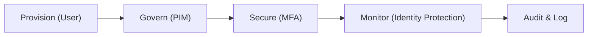

### 3. Distributed Identity Fabric Topology
Strategically orchestrating identity across global cloud regions, B2B/B2C tenants, and hybrid directory services, providing a unified institutional view of global identity health and behavioral readiness.

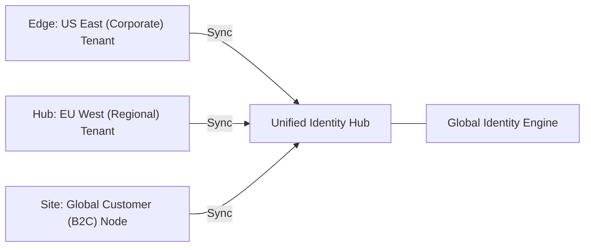

### 4. Zero-Trust & High-Trust Data Plane Protection Flow
Executing complex logic for securing the bridge between identity providers and conditional access policies, ensuring every organizational identity is verified and every identity access is according to institutional standards.

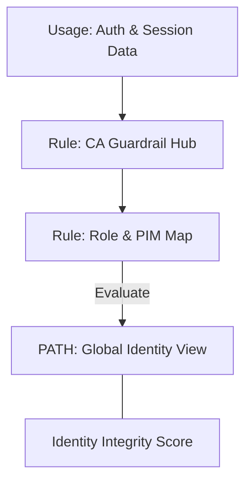

### 5. Multi-Tenant Identity Federation & Governance Flow
Automatically managing unified identity standards across global regions and diverse Entra ID tenants, ensuring institutional data residency and security boundaries by default.

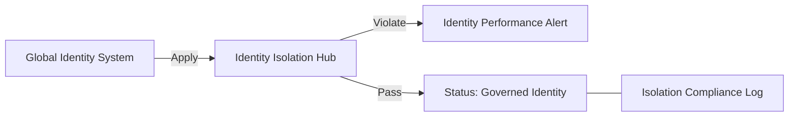

### 6. Encryption & Perimeter Protection Flow (Identity Standard)
Managing the lifecycle of an identity request, automatically enforcing institutional FIDO2 and certificate-based authentication standards as required by security policy, ensuring zero-latency security confidence.

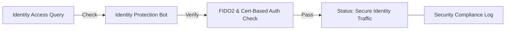

### 7. Institutional Identity Maturity Scorecard
Grading organizational performance based on key indicators: Security Coverage Grade, MFA Adoption Index, and PIM Utilization Index.

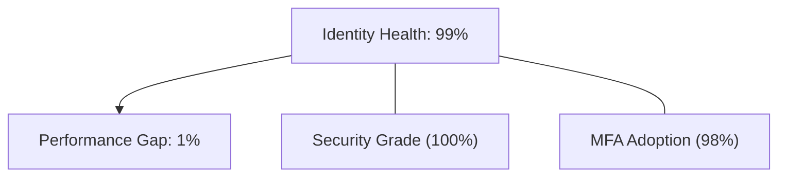

### 8. Identity & RBAC for Identity Governance
Managing fine-grained access to identity hubs, provisioning workers, and audit logs between Identity Architects, Compliance Auditors, and Global Admins.

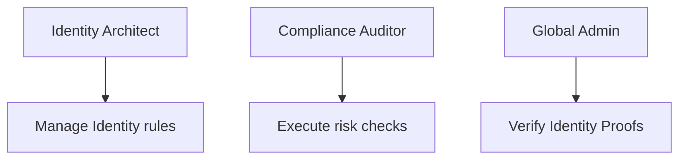

### 9. IaC Deployment: Entra-ID-Maestro-as-Code Framework
Using modular Terraform to deploy and manage the versioned distribution of the identity tracking hubs, CA protection workers, and forensic metadata lakes.

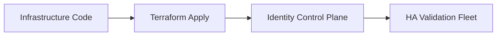

### 10. AIOps Identity Drift & Risk Validation Flow
Using advanced analytics to identify sudden surges in suspicious logins, unauthorized role assignments, suspicious configuration drifts, or unusual identity pattern changes that could result in institutional risk.

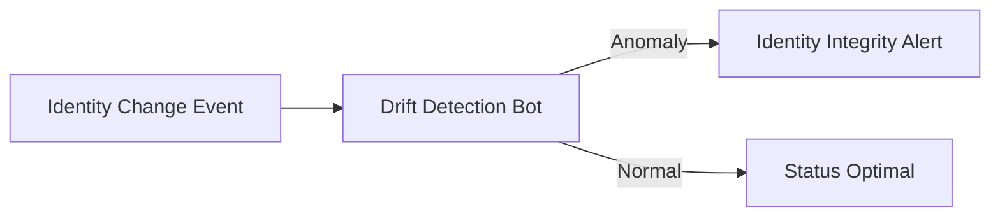

### 11. Metadata Lake for Forensic Identity Audit
Storing long-term records of every role change (metadata), every security event recorded, and every sign-in log for institutional record-keeping, compliance auditing, and post-provisioning forensics.

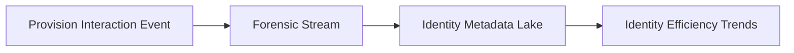

---

## 🏛️ Core Governance Pillars

1.  **Unified Foundation Coordination**: Maximizing resilience by centralizing all identity measurement through a single institutional plane.
2.  **Automated User Provisioning**: Eliminating "manual identity" scenarios through proactive orchestration and pattern verification.
3.  **Sequential Lifecycle Intelligence**: Ensuring zero-interruption operations through dependency-aware lifecycle-driven identity engineering.
4.  **Zero-Trust Identity Protection**: Automatically enforcing identity-based access and rule evaluation across all identity tiers.
5.  **Autonomous Operations Logic**: Guaranteeing reliability through automated industry-specific identity monitoring runbooks.
6.  **Full Identity Auditability**: Immutable recording of every role change and user provision for institutional forensics.

---

## 🛠️ Technical Stack & Implementation

### Identity Engine & APIs
*   **Framework**: Python 3.11+ / FastAPI.
*   **Performance Engine**: Custom Python-based logic for multi-tenant identity provisioning and DORA-style risk metrics.
*   **Integrations**: Native connectors for Microsoft Entra ID (Graph API), Intune, and Defender.
*   **Persistence**: PostgreSQL (Identity Ledger) and Redis (Live CA State).
*   **Auth Orchestrator**: Federated OIDC/SAML for least-privilege identity management access.

### Governance Dashboard (UI)
*   **Framework**: React 18 / Vite.
*   **Theme**: Dark, Slate, Indigo (Modern high-fidelity identity aesthetic).
*   **Visualization**: D3.js for identity topologies and Recharts for MFA velocity analytics.

### Infrastructure & DevOps
*   **Runtime**: AWS EKS or Azure Kubernetes Service (AKS) for management plane.
*   **Identity Hub**: Managed event sourcing for immutable identity security timeline reconstruction.
*   **IaC**: Modular Terraform for deploying the identity landing zone and validation fleet.

---

## 🏗️ IaC Mapping (Module Structure)

| Module | Purpose | Real Services |
| :--- | :--- | :--- |
| **`infrastructure/identity_hub`** | Central management plane | EKS, PostgreSQL, Redis |
| **`infrastructure/enforcers`** | Distributed identity provisioners | Entra ID, Intune, Defender APIs |
| **`infrastructure/user_pipes`** | Identity Ingestion Hubs | Webhooks, Lambda |
| **`infrastructure/auditing`** | Forensic identity sinks | S3, Athena, Quicksight |

---

## 🚀 Deployment Guide

### Local Principal Environment
```bash
# Clone the landing zone platform
git clone https://github.com/devopstrio/entra-id-maestro.git
cd entra-id-maestro

# Configure environment
cp .env.example .env

# Launch the EI-M stack
make init

# Trigger a mock user update and automated risk validation simulation
make simulate-eim
```

Access the Management Portal at `http://localhost:3000`.

---

## 📜 License
Distributed under the MIT License. See `LICENSE` for more information.

---
<div align="center">
  <p>© 2026 Devopstrio. All rights reserved.</p>
</div>
